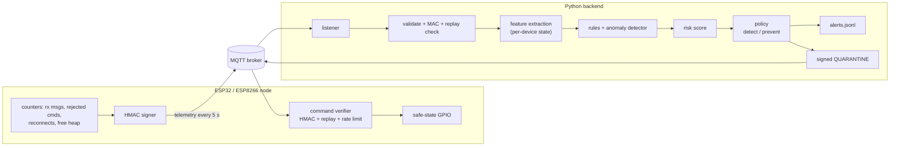

# IoT IDPS — telemetry-based intrusion detection and response for ESP32/ESP8266

ESP32 and ESP8266 nodes publish signed health and traffic counters over MQTT.
A Python backend flags attacks on those nodes with rules and an anomaly
detector, scores the risk, and can put a node into a fail-safe quarantine
using authenticated commands.

[](https://github.com/edogouroguhr/iot_idps/actions/workflows/ci.yml)


> **Status: research prototype.** The firmware compiles for both boards, and
> its protocol logic is tested on a PC against the backend. The full
> pipeline runs end-to-end against a real MQTT broker in CI. It has **not**
> yet been validated on physical hardware or against real attack traffic.
> All detection metrics come from **synthetic** data. See
> [Limitations](#limitations).

---

## Contents

- [Problem](#problem) · [What it does](#what-it-does) · [Architecture](#architecture)
- [Detection](#detection-pipeline) · [Prevention](#prevention-pipeline) · [ML methodology](#ml-methodology)
- [Requirements](#requirements) · [Quick start](#quick-start-no-hardware) · [Installation](#installation) · [Configuration](#configuration)
- [Firmware](#firmware-setup) · [Backend](#backend-setup) · [Training](#model-training) · [Inference](#inference--live-operation)
- [Example output](#example-output) · [Testing](#testing) · [Evaluation](#evaluation)
- [Security](#security-considerations) · [Limitations](#limitations) · [Future work](#future-work)
- [Repository structure](#repository-structure) · [Contributing](#contributing) · [License](#license) · [Citation](#citation)

## Problem

Small IoT nodes such as ESP32 and ESP8266 boards usually trust their MQTT
broker completely. Anyone who can publish to a node's command topic can
change its state, flood it, or kick it off the broker by reusing its client
id. These nodes are too small to run a conventional host IDS. Network IDSs
see MQTT traffic but have no view of how the device itself is doing.

## Why this project exists

The project explores a lightweight split design:

* **On the device:** cheap, trustworthy *observation* (counters the node
  maintains anyway) and *enforcement* (refuse unauthenticated commands, drive
  outputs to a safe state).
* **On a backend:** detection, risk scoring and policy, where CPU and memory
  are cheap.

The project started as a coursework prototype (v0.1.0). Version 0.2.0
rebuilds it so that each claim in this README is backed by code and tests.
[CHANGELOG.md](CHANGELOG.md) lists what was wrong with the prototype.

## What it does

| | Status |
|---|---|
| Signed telemetry from ESP32/ESP8266 (HMAC-SHA256, per-device keys) | **Implemented**: compile-tested on both boards; logic host-tested |
| Authenticated, replay-protected commands (`PING`, `QUARANTINE`, `RELEASE`) | **Implemented**: host-tested |
| Rule detection: malformed, spoofed, replayed, unknown-device telemetry; command rejection bursts; offline devices | **Implemented**: unit-tested |
| Anomaly detection: Isolation Forest + z-score ensemble on 6 behavioural features | **Implemented**: evaluated on synthetic data only |
| Risk scoring → policy → response, `detect` (IDS) or `prevent` (IPS) mode | **Implemented**: unit- and integration-tested |
| Device quarantine: safe-state GPIO, auto-release | **Implemented**: needs hardware validation |
| Resilient firmware: non-blocking reconnects, watchdog, last-resort reboot | **Implemented**: needs hardware validation |
| MQTT over TLS (device and backend) | **Supported, off by default**: compile-tested only |
| Host firewall blocking of attacker IPs | **Experimental**: no event source supplies IPs yet; dry-run by default |
| Real-world attack dataset, broker-level enforcement, dashboard | **Planned** |

Is it an IDPS? Partly. It detects attacks and takes one real
preventive action: quarantining the targeted device so its outputs fail safe.
It does **not** stop the attacker's traffic at the network or broker. That
needs broker integration (see [Future work](#future-work)).

## Architecture



Detailed diagrams are in [docs/architecture.md](docs/architecture.md):
system, detection pipeline, risk/prevention pipeline, and an MQTT sequence
diagram.

## Detection pipeline

1. **Validate:** topic and JSON schema, ranges, size ≤ 1 KiB, `device_id`
   matches the topic.
2. **Authenticate:** recompute the HMAC over a canonical string; on failure,
   raise `telemetry_auth_failure`.
3. **Track state** per device. A `seq` regression, or a `boot_id` from an
   earlier boot, is a `telemetry_replay`. A new `boot_id` is a reboot.
4. **Extract features:** `rx_rate`, `auth_fail_rate`, `heap_drop_kb`,
   `wifi_reconnects`, `mqtt_reconnects`, `interval_s`.
5. **Rules:** if the device rejected ≥ 3 commands in the window, raise
   `device_command_rejections`.
6. **Anomaly detection:** score > 1.0 raises `ml_anomaly`, with an
   explanation (most deviant feature). Without a model, the engine runs
   rules only.

## Prevention pipeline

| Severity (risk score) | `detect` mode (default) | `prevent` mode |
|---|---|---|
| LOW (≤ 30) | log | log |
| MEDIUM (31-60) | log + alert | log + alert |
| HIGH (61-80) | log + alert | + **quarantine**, if the finding is device-attributable and the device was flagged in ≥ 3 of its last 5 windows |
| CRITICAL (81-100) | log + alert | as HIGH; + block source IP (experimental, needs IP + firewall enabled) |

Safeguards against false positives:

* Spoofed or malformed traffic never triggers a device action.
* Uncertain detections stay at MEDIUM and only raise an alert.
* Nothing is resent once the device confirms `quarantined=1`. Until then,
  the command is retried at most once every 30 s.
* The firmware releases quarantine automatically after 15 minutes. An
  operator can send `RELEASE` at any time.

The trade-off: an attacker who can publish to a device's command topic can
*provoke* a quarantine by flooding it. That is fail-safe by design, but it is
still an availability cost. Restrict the command topic with broker ACLs (see
[docs/security.md](docs/security.md#residual-risks-not-solved)).

## ML methodology

* **Task:** semi-supervised novelty detection per 5-second telemetry window.
  The detector trains on normal data only.
* **Model:** Isolation Forest + per-feature z-score. Each component is
  calibrated to half of a 1 % false-positive budget on held-out normal
  windows. Isolation Forest alone could not detect attacks that push values
  beyond the training range (see the evaluation).
* **No leakage:** the same feature code runs for training and live use;
  splits are chronological per device; the test data is never used for fitting.
* **Baselines:** Isolation Forest only, z-score only, and a 10-seed
  benchmark with mean ± std.
* **Reproducibility:** fixed seeds, deterministic data generator, and a
  versioned model file that records its feature set and library versions.

Full details are in [docs/evaluation.md](docs/evaluation.md).

## Requirements

**Hardware** (optional for the simulation): an ESP32 DevKit and/or a NodeMCU
(ESP8266), a USB cable, a 2.4 GHz Wi-Fi network, and a machine that can run
an MQTT broker (e.g. Mosquitto).

**Software:** Python 3.10-3.13. For the firmware: PlatformIO 6.x, which
installs the toolchains and pinned libraries (PubSubClient 2.8, ArduinoJson
7.4.2) on its own.

## Quick start (no hardware)

```bash
git clone https://github.com/edogouroguhr/iot_idps.git && cd iot_idps
python -m venv .venv && source .venv/bin/activate      # Windows: .venv\Scripts\activate
pip install -e ".[dev]"
python -m idps simulate --mode prevent                  # synthetic devices -> full engine, offline
```

## Installation

```bash
pip install -e ".[dev]"          # backend + test tools
pip install platformio           # only for firmware
```

## Configuration

Backend settings come from environment variables, optionally loaded from
`.env`:

```bash
cp .env.example .env
python -m idps gen-key --device-id esp32_01     # add the printed pair to IDPS_DEVICE_KEYS
python -m idps check-config                     # validates; never prints secrets
```

The firmware reads its secrets from `firmware/include/secrets.h` (copy it
from `secrets.example.h`) and its tunables from
`firmware/include/idps_config.h`. Both files are git-ignored. The device key
must be identical on both sides.

## Firmware setup

```bash
cd firmware
cp include/secrets.example.h include/secrets.h   # Wi-Fi, broker, device id, key
pio run                                          # build both boards
pio run -e esp32dev -t upload                    # or -e nodemcuv2
pio device monitor -b 115200                     # expect "HMAC self-test PASS"
```

For TLS, build with `PLATFORMIO_BUILD_FLAGS="-DIDPS_MQTT_USE_TLS=1"` and put
your CA certificate in `secrets.h`. See [docs/hardware.md](docs/hardware.md)
for the on-device validation checklist.

## Backend setup

Run a broker you control. A hardened Mosquitto config with per-device ACLs
is in [deploy/mosquitto/](deploy/mosquitto/). For a quick local lab test:

```bash
mosquitto -v -p 1883             # local test only: anonymous, no TLS
```

## Model training

```bash
python -m idps generate-data                   # synthetic, seed 42 -> data/synthetic/telemetry.jsonl
python -m idps train                           # -> models/isolation_forest.joblib, reports/train_eval.md
python -m idps benchmark --seeds 10            # -> reports/benchmark.md
python -m idps train --detector zscore         # alternative detector kinds: ensemble | iforest | zscore
```

To train on your own devices, record a baseline of normal operation first:

```bash
python -m idps listen --record data/raw/baseline.jsonl --label normal
python -m idps train --data data/raw/baseline.jsonl     # reports false-positive rate on unseen normal data
```

## Inference / live operation

```bash
python -m idps listen                                  # uses .env; IDPS_MODE=detect by default
python -m idps send-command esp32_01 PING              # authenticated manual command
python -m idps send-command esp32_01 RELEASE
python -m idps evaluate --data <labelled.jsonl>        # score a saved model on another dataset
```

Alerts are written to `logs/alerts.jsonl`, one JSON object per decision.

## Example output

The output below is real, from `python -m idps simulate --mode prevent`
(synthetic data, seed 42), shortened:

```text
WARNING idps.response: CRITICAL ml_anomaly device=esp32_02 risk=100 actions=LOG,ALERT | anomaly score 2.60 > 1.00; [ensemble] iforest=0.99 zscore=2.60 (most deviant feature: interval_s, |z|=61.2)
WARNING idps.response: sent QUARANTINE to esp32_02
WARNING idps.response: CRITICAL ml_anomaly device=esp32_02 risk=100 actions=LOG,ALERT,QUARANTINE_DEVICE | anomaly score 1.61 > 1.00; [ensemble] iforest=0.85 zscore=1.61 (most deviant feature: wifi_reconnects, |z|=37.9)

replayed 3000 telemetry messages in 'prevent' mode
findings: {'ml_anomaly': 608, 'device_command_rejections': 193, 'device_reboot': 2}
alerts:   801 (582 de-duplicated)
commands published (dry-run, not sent to any broker): 28
quarantines by ground-truth label of the triggering window: {'wifi_deauth': 5, 'clientid_hijack': 4, 'cmd_flood': 7, 'heap_exhaustion': 9, 'forged_cmd': 3}
```

All 28 automated quarantines in this run were triggered by attack windows,
none by normal windows. That is one seed of synthetic data, not a guarantee.

## Testing

```bash
pytest                                             # unit, engine, CLI, firmware-consistency tests
IDPS_TEST_BROKER=127.0.0.1:1883 pytest             # + live MQTT integration test (needs a broker)
ruff check .
```

`tests/test_firmware_host.py` compiles the firmware's command and telemetry
code with the host C++ compiler. It then checks that the firmware accepts
backend commands, rejects forged, replayed, stale and malformed ones, and
emits telemetry byte-identical to the backend encoder. It needs `g++` and
ArduinoJson; CI runs it after the PlatformIO build.

CI ([.github/workflows/ci.yml](.github/workflows/ci.yml)) runs: ruff, pytest
on Python 3.10 and 3.12 with a Mosquitto container, an ML pipeline smoke
test, firmware builds for ESP32 and ESP8266 with and without TLS, the
host-compiled firmware tests, and a check that no secrets or artifacts are
tracked.

## Evaluation

The numbers below are from **synthetic data**: seeds 0-9, 1 % FPR budget,
mean ± std.

| Detector | Precision | Recall | F1 | FPR | PR-AUC |
|---|---|---|---|---|---|
| Ensemble (IF + z-score), default | 0.960 ± 0.013 | 0.654 ± 0.058 | 0.776 ± 0.042 | 0.008 | 0.853 |
| Isolation Forest only | 0.916 ± 0.019 | 0.428 ± 0.115 | 0.575 ± 0.112 | 0.012 | 0.797 |
| z-score only | 0.971 ± 0.015 | 0.681 ± 0.040 | 0.800 ± 0.028 | 0.006 | 0.853 |

The honest reading:

* Adding the z-score component fixes Isolation Forest's blind spots.
* On this data, the simple z-score baseline matches the ensemble. The
  synthetic attacks mostly shift one feature at a time, which favours a
  per-feature detector.
* Real captures are needed to decide which detector is better.

Per-attack results, episode-level detection and latency (~13 ms per single
window, ~13 µs batched) are in [docs/evaluation.md](docs/evaluation.md).

## Security considerations

* **Keys:** one HMAC key per device, generated with `idps gen-key`, stored in
  git-ignored files. Keys are symmetric: the backend `.env` can impersonate
  every device, so protect it.
* **Use your own broker** with authentication, the ACLs in `deploy/`, and TLS.
  HMAC protects integrity, not confidentiality.
* **Not protected:** physical key extraction (no flash encryption), a fully
  compromised device lying in correctly signed telemetry, the unauthenticated
  MQTT last-will topic, and a one-time replay window after a backend restart.
* Model files are pickles: never load one you did not train.

The threat model, controls, residual risks and the issues fixed from the
prototype are in [docs/security.md](docs/security.md).

## Limitations

* **No hardware validation in this release.** See the checklist in
  [docs/hardware.md](docs/hardware.md).
* **Synthetic data only.** The metrics are not real-world performance.
* **Detection scope.** The detector sees only what the node can count. It
  does not inspect packets, so it cannot detect attacks that leave these
  counters unchanged.
* **Prevention is device-side and cooperative.** Quarantine makes outputs
  fail safe. It does not block the attacker or contain a compromised device.
* **In-memory backend state.** A restart forgets replay history. Each run
  supports one backend instance.
* **Experimental IP blocking.** No sensor supplies attacker IPs yet.

## Future work

- Collect a real labelled dataset (baseline plus authorised lab attacks) and
  re-run the detector comparison.
- Enforce at the broker: disconnect or ban clients via Mosquitto dynamic
  security, and per-client rate limits.
- Persist replay counters (NVS/EEPROM on the device, SQLite on the backend).
- Device-specific baselines or online adaptation for heterogeneous fleets.
- ESP32 flash encryption and secure boot; per-device asymmetric keys.
- A dashboard on top of `alerts.jsonl`.

## Repository structure

```
iot_idps/
├── firmware/                 PlatformIO project (ESP32 + ESP8266)
│   ├── include/              idps_config.h, secrets.example.h, protocol_vectors.h
│   ├── src/                  main.cpp, commands.*, telemetry.*, hmac_auth.*, util.h
│   └── test/host/            host harness + reference SHA-256 (tests only)
├── idps/                     Python backend package
│   ├── protocol.py           wire format, MACs, validation
│   ├── features.py           per-device tracking + features
│   ├── detector.py           Isolation Forest + z-score
│   ├── risk.py, policy.py    scoring and response decisions
│   ├── response.py           alerts, device commands, firewall
│   ├── engine.py             pipeline orchestration
│   ├── mqtt_runtime.py       live MQTT client
│   ├── synthetic.py          synthetic data generator
│   ├── evaluation.py         training, evaluation, benchmark
│   └── cli.py                `python -m idps ...`
├── tests/                    pytest suite (incl. host-compiled firmware tests)
├── docs/                     architecture, protocol, security, evaluation, hardware
├── deploy/mosquitto/         hardened broker config + ACL examples
├── data/, models/            generated locally, not committed (see their READMEs)
├── .github/workflows/ci.yml
├── .env.example, pyproject.toml, requirements.txt, CHANGELOG.md, LICENSE
```

## Contributing

Issues and pull requests are welcome. Before opening a PR:

1. `ruff check . && pytest` pass.
2. If you change the wire protocol, update `idps/protocol.py`, the firmware
   and `docs/protocol.md` together. The consistency and host tests will tell
   you if they diverge.
3. Never commit `.env`, `secrets.h`, datasets or model files.
4. Do not add claims about detection performance without a reproducible
   command and data source.

## License

MIT. See [LICENSE](LICENSE).

## Author

Maintained by [@edogouroguhr](https://github.com/edogouroguhr).

## Citation

If you reference this work:

```bibtex
@software{iot_idps,
  author  = {edogouroguhr},
  title   = {IoT IDPS: Telemetry-based Intrusion Detection and Response for ESP32/ESP8266},
  year    = {2026},
  version = {0.2.0},
  url     = {https://github.com/edogouroguhr/iot_idps}
}
```
