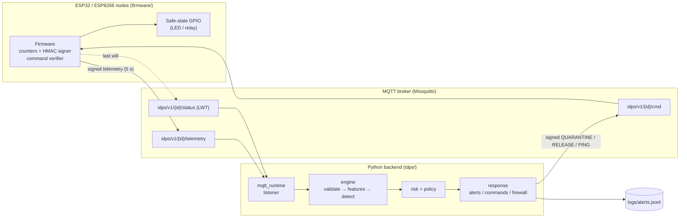
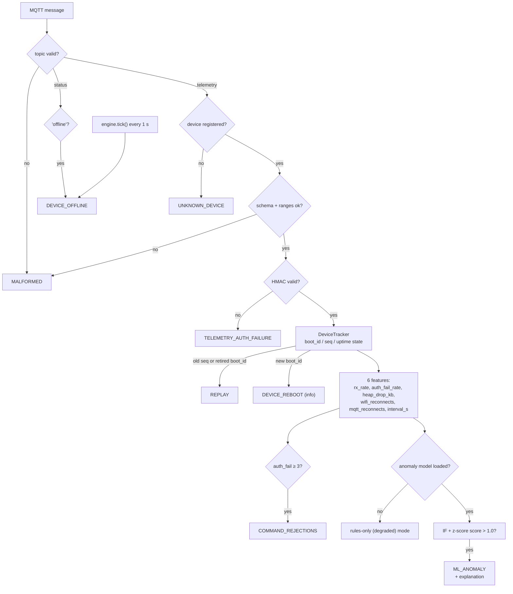
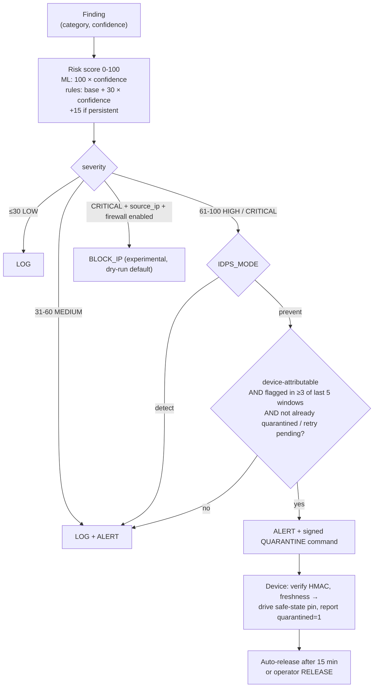
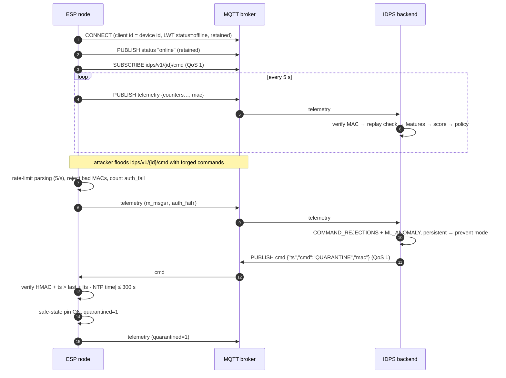

# Architecture

## 1. System overview

The node is both the **sensor** (it reports what it observes about traffic
aimed at it and about its own health) and the **enforcement point** (it can
put its outputs into a safe state). The backend does detection, scoring and
policy.

## 2. Detection pipeline

Key properties:

* The tracker only ever sees **authenticated** telemetry, so an attacker
  cannot poison replay state by forging a high `seq`.
* The same `DeviceTracker` code produces the training features and the live
  features (no train/serve skew).
* If the model file is missing, corrupt, or was trained on a different feature
  set, the engine logs a warning and keeps running on rules only.

## 3. Risk scoring and prevention pipeline

Why these gates exist:

| Concern | Mechanism |
|---|---|
| A single noisy window triggers an action | Persistence: 3 of the last 5 windows must be flagged |
| Uncertain detections | Scores just above threshold land in MEDIUM → alert only |
| Spoofed traffic used to make us quarantine a healthy device | Only *authenticated, device-attributable* findings (ML anomaly, command rejections) can trigger quarantine |
| Command storms from the IDPS itself | No resend once the device reports `quarantined=1`; until then at most one retry per 30 s (the device may drop commands under a flood) |
| False positive locks a device out forever | Firmware auto-releases quarantine after 15 min (configurable) |
| Operator wants an IDS, not an IPS | `IDPS_MODE=detect` (default) never acts |

## 4. Communication / sequence

## 5. Code map

| Layer | Module | Responsibility |
|---|---|---|
| Firmware | `firmware/src/main.cpp` | Wi-Fi/MQTT state machines, watchdog, telemetry timer, quarantine |
| | `firmware/src/commands.cpp` | Command parsing, HMAC/replay/freshness checks, rate limiter |
| | `firmware/src/telemetry.cpp` | Signed telemetry serialisation |
| | `firmware/src/hmac_auth.cpp` | HMAC-SHA256 via mbedTLS / BearSSL, boot self-test |
| Wire contract | `idps/protocol.py` | Topics, canonical MAC strings, validation limits |
| Ingestion | `idps/mqtt_runtime.py` | paho-mqtt client, TLS/auth, recording |
| Features | `idps/features.py` | Per-device state, replay/reboot detection, feature vector |
| Detection | `idps/detector.py` | Isolation Forest + z-score, calibration, persistence |
| Scoring | `idps/risk.py` | Finding → score → severity |
| Policy | `idps/policy.py` | Severity + mode + persistence → actions |
| Response | `idps/response.py` | JSONL alerts, signed commands, firewall (experimental) |
| Orchestration | `idps/engine.py` | Wires the above together; dedup, cooldowns, offline detection |
| Research | `idps/synthetic.py`, `idps/evaluation.py` | Synthetic data, train/eval, benchmark |
